# UI flow diagrams: individual screens
## State and interaction flows (mobile baseline)

This document provides state and interaction flow diagrams for individual screens across the platform. While [SCREENS_AND_FLOWS.md](./SCREENS_AND_FLOWS.md) presents module-level navigation and [SCREENS_MOBILE.md](./SCREENS_MOBILE.md) details component requirements, this document covers individual screens across MVP and Enterprise tiers, alongside common sub-screen patterns. Each diagram outlines internal states, modals, subscription gating branches, and navigation boundaries.

For screen field specifications, consult [SCREENS_MOBILE.md](./SCREENS_MOBILE.md). Route paths and deep links are listed in [DYNAMIC_LINKING.md](./DYNAMIC_LINKING.md). Breakpoint adaptations for larger screens appear in [SCREENS_TABLET.md](./SCREENS_TABLET.md) and [SCREENS_DESKTOP.md](./SCREENS_DESKTOP.md). State logic and tier rules remain identical across platforms, with only layout structure shifting by breakpoint.

Tier shorthand used in diagrams: **F** = Free, **P** = Premium, **E** = Enterprise.

---

## 0. Cross-cutting sub-screen state machine
This lifecycle applies across screens whenever loading, empty, and error states occur.

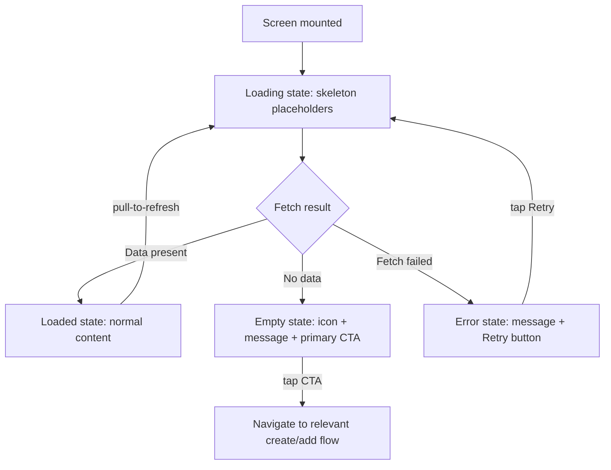
```mermaid
flowchart TD
    A[Screen mounted] --> B[Loading state: skeleton placeholders]
    B --> C{Fetch result}
    C -- Data present --> D[Loaded state: normal content]
    C -- No data --> E[Empty state: icon + message + primary CTA]
    C -- Fetch failed --> F[Error state: message + Retry button]
    F -->|tap Retry| B
    D -->|pull-to-refresh| B
    E -->|tap CTA| G[Navigate to relevant create/add flow]
```

---

## 1. Auth and profile

### Splash and onboarding
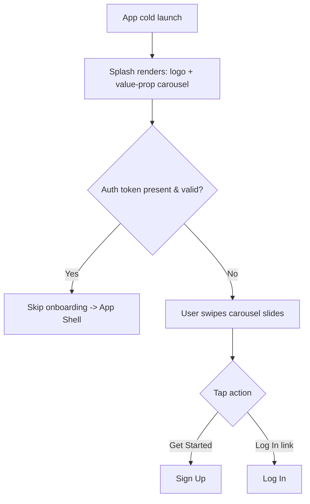
```mermaid
flowchart TD
    A[App cold launch] --> B[Splash renders: logo + value-prop carousel]
    B --> C{Auth token present & valid?}
    C -- Yes --> D[Skip onboarding -> App Shell]
    C -- No --> E[User swipes carousel slides]
    E --> F{Tap action}
    F -- Get Started --> G[Sign Up]
    F -- Log In link --> H[Log In]
```

### Sign up
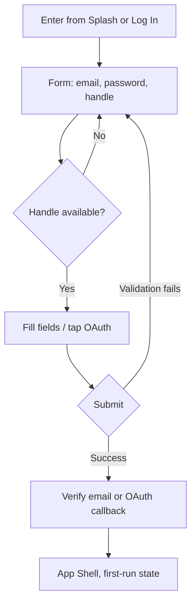
```mermaid
flowchart TD
    A[Enter from Splash or Log In] --> B[Form: email, password, handle]
    B --> C{Handle available?}
    C -- No --> B
    C -- Yes --> D[Fill fields / tap OAuth]
    D --> E{Submit}
    E -- Validation fails --> B
    E -- Success --> F[Verify email or OAuth callback]
    F --> G[App Shell, first-run state]
```

### Log in
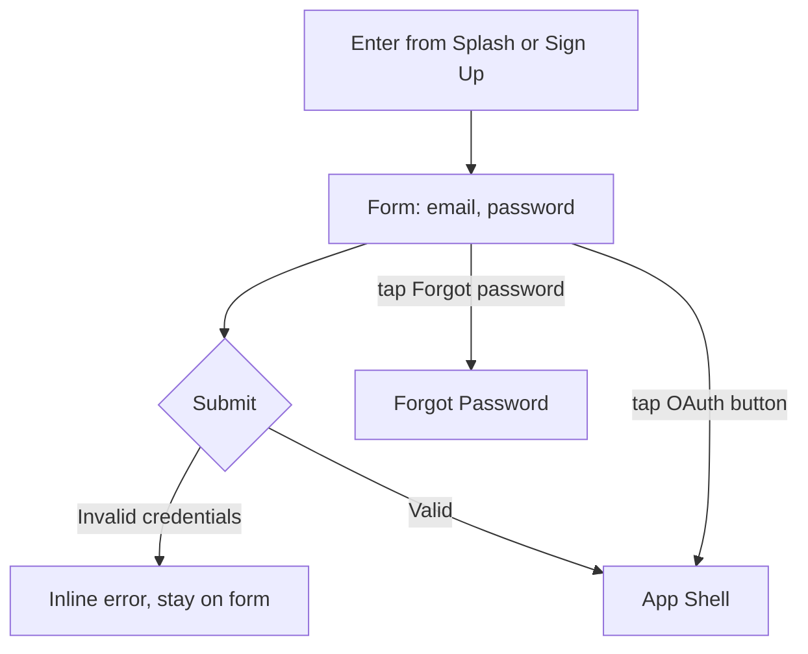
```mermaid
flowchart TD
    A[Enter from Splash or Sign Up] --> B[Form: email, password]
    B --> C{Submit}
    C -- Invalid credentials --> D[Inline error, stay on form]
    C -- Valid --> E[App Shell]
    B -->|tap Forgot password| F[Forgot Password]
    B -->|tap OAuth button| E
```

### Forgot password
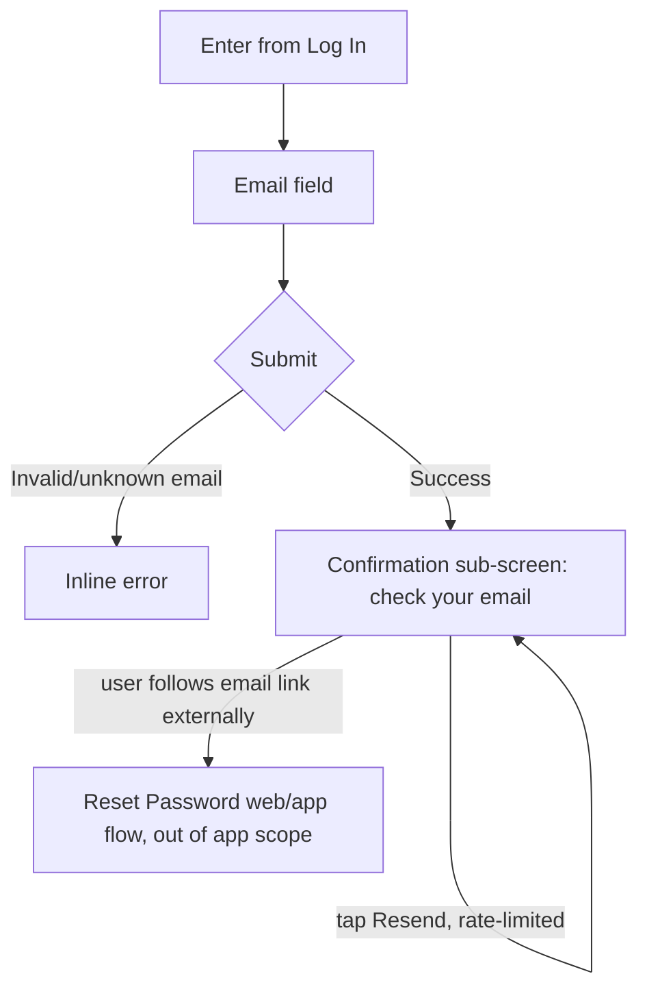
```mermaid
flowchart TD
    A[Enter from Log In] --> B[Email field]
    B --> C{Submit}
    C -- Invalid/unknown email --> D[Inline error]
    C -- Success --> E[Confirmation sub-screen: check your email]
    E -->|tap Resend, rate-limited| E
    E -->|user follows email link externally| F[Reset Password web/app flow, out of app scope]
```

### Personal profile
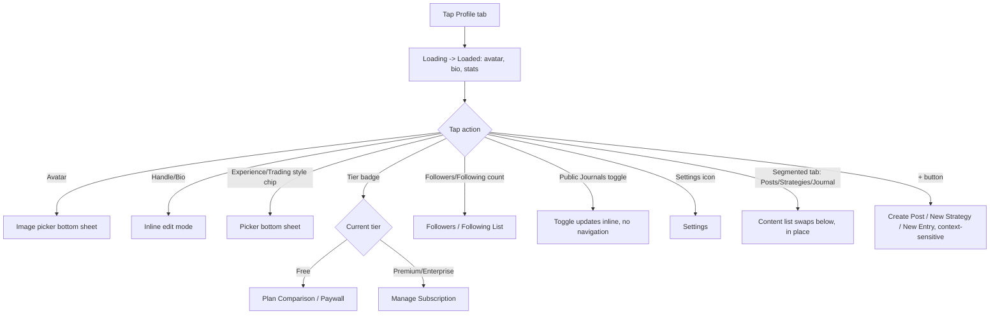
```mermaid
flowchart TD
    A[Tap Profile tab] --> B[Loading -> Loaded: avatar, bio, stats]
    B --> C{Tap action}
    C -- Avatar --> D[Image picker bottom sheet]
    C -- Handle/Bio --> E[Inline edit mode]
    C -- Experience/Trading style chip --> F[Picker bottom sheet]
    C -- Tier badge --> G{Current tier}
    G -- Free --> H[Plan Comparison / Paywall]
    G -- Premium/Enterprise --> I[Manage Subscription]
    C -- Followers/Following count --> J[Followers / Following List]
    C -- Public Journals toggle --> K[Toggle updates inline, no navigation]
    C -- Settings icon --> L[Settings]
    C -- Segmented tab: Posts/Strategies/Journal --> M[Content list swaps below, in place]
    C -- + button --> N[Create Post / New Strategy / New Entry, context-sensitive]
```

### Public profile for another user
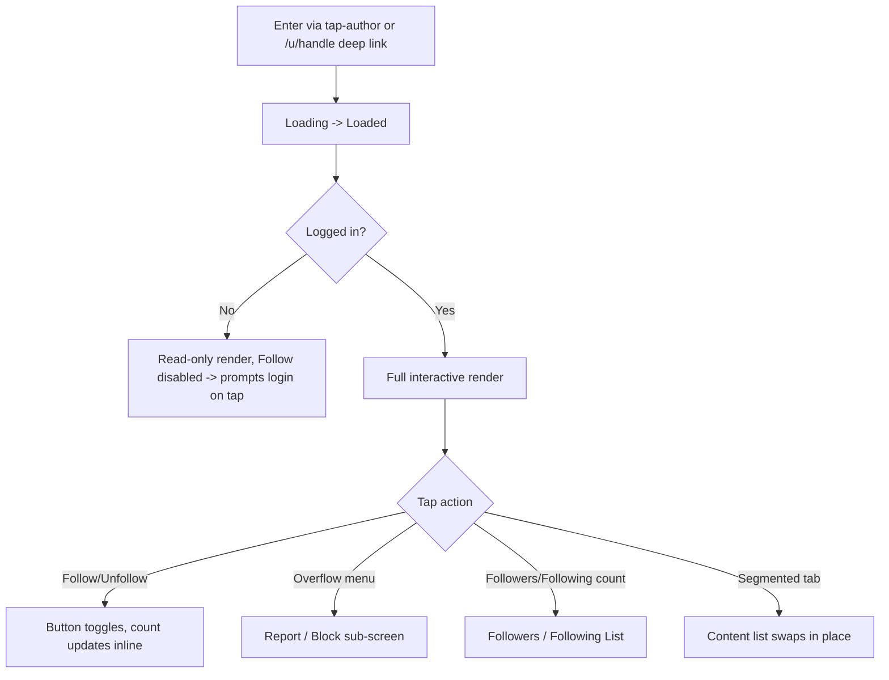
```mermaid
flowchart TD
    A[Enter via tap-author or /u/handle deep link] --> B[Loading -> Loaded]
    B --> C{Logged in?}
    C -- No --> D[Read-only render, Follow disabled -> prompts login on tap]
    C -- Yes --> E[Full interactive render]
    E --> F{Tap action}
    F -- Follow/Unfollow --> G[Button toggles, count updates inline]
    F -- Overflow menu --> H[Report / Block sub-screen]
    F -- Followers/Following count --> I[Followers / Following List]
    F -- Segmented tab --> J[Content list swaps in place]
```

### Settings
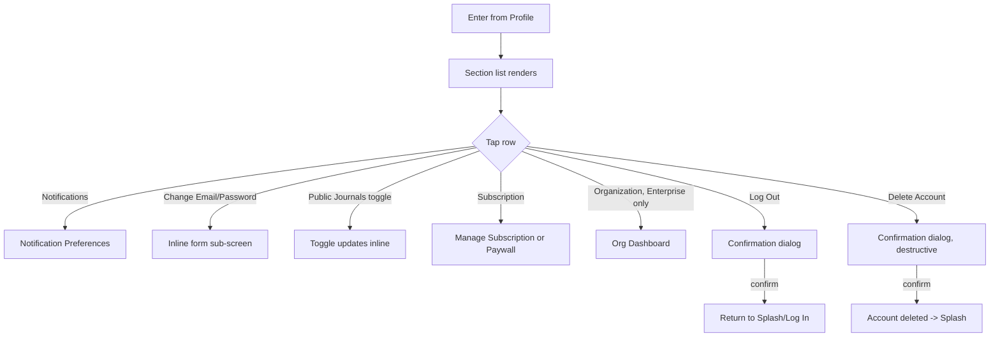
```mermaid
flowchart TD
    A[Enter from Profile] --> B[Section list renders]
    B --> C{Tap row}
    C -- Notifications --> D[Notification Preferences]
    C -- Change Email/Password --> E[Inline form sub-screen]
    C -- Public Journals toggle --> F[Toggle updates inline]
    C -- Subscription --> G[Manage Subscription or Paywall]
    C -- Organization, Enterprise only --> H[Org Dashboard]
    C -- Log Out --> I[Confirmation dialog] -->|confirm| J[Return to Splash/Log In]
    C -- Delete Account --> K[Confirmation dialog, destructive] -->|confirm| L[Account deleted -> Splash]
```

---

## 2. Trading journal

### Journal list
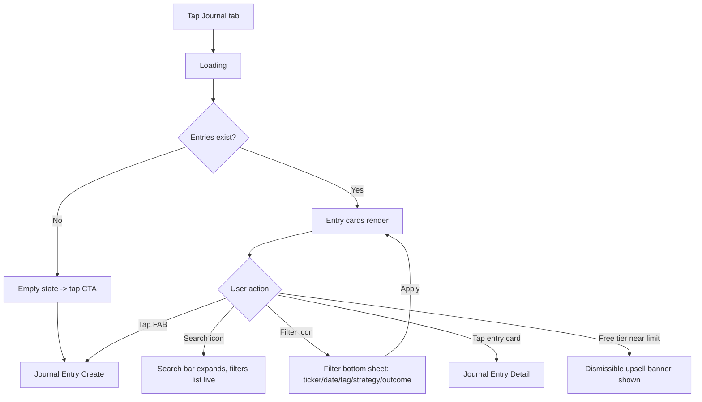
```mermaid
flowchart TD
    A[Tap Journal tab] --> B[Loading]
    B --> C{Entries exist?}
    C -- No --> D[Empty state -> tap CTA]
    C -- Yes --> E[Entry cards render]
    D --> F[Journal Entry Create]
    E --> G{User action}
    G -- Search icon --> H[Search bar expands, filters list live]
    G -- Filter icon --> I[Filter bottom sheet: ticker/date/tag/strategy/outcome]
    I -->|Apply| E
    G -- Tap FAB --> F
    G -- Tap entry card --> J[Journal Entry Detail]
    G -- Free tier near limit --> K[Dismissible upsell banner shown]
```

### Journal entry detail
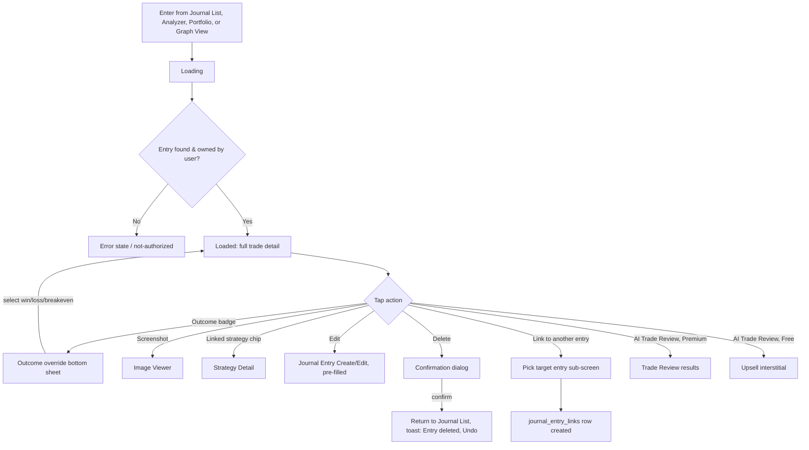
```mermaid
flowchart TD
    A[Enter from Journal List, Analyzer, Portfolio, or Graph View] --> B[Loading]
    B --> C{Entry found & owned by user?}
    C -- No --> D[Error state / not-authorized]
    C -- Yes --> E[Loaded: full trade detail]
    E --> F{Tap action}
    F -- Outcome badge --> G[Outcome override bottom sheet]
    G -->|select win/loss/breakeven| E
    F -- Screenshot --> H[Image Viewer]
    F -- Linked strategy chip --> I[Strategy Detail]
    F -- Edit --> J[Journal Entry Create/Edit, pre-filled]
    F -- Delete --> K[Confirmation dialog] -->|confirm| L[Return to Journal List, toast: Entry deleted, Undo]
    F -- Link to another entry --> M[Pick target entry sub-screen] --> N[journal_entry_links row created]
    F -- AI Trade Review, Premium --> O[Trade Review results]
    F -- AI Trade Review, Free --> P[Upsell interstitial]
```

### Journal entry creation and editing
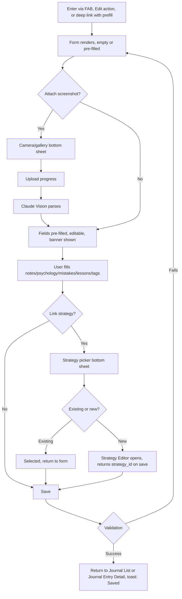
```mermaid
flowchart TD
    A[Enter via FAB, Edit action, or deep link with prefill] --> B[Form renders, empty or pre-filled]
    B --> C{Attach screenshot?}
    C -- Yes --> D[Camera/gallery bottom sheet] --> E[Upload progress] --> F[Claude Vision parses] --> G[Fields pre-filled, editable, banner shown]
    C -- No --> G
    G --> H[User fills notes/psychology/mistakes/lessons/tags]
    H --> I{Link strategy?}
    I -- Yes --> J[Strategy picker bottom sheet] --> K{Existing or new?}
    K -- Existing --> L[Selected, return to form]
    K -- New --> M[Strategy Editor opens, returns strategy_id on save]
    I -- No --> N[Save]
    L --> N
    M --> N
    N --> O{Validation}
    O -- Fails --> B
    O -- Success --> P[Return to Journal List or Journal Entry Detail, toast: Saved]
```

---

## 3. Strategy notes and analyzer

### Strategy list
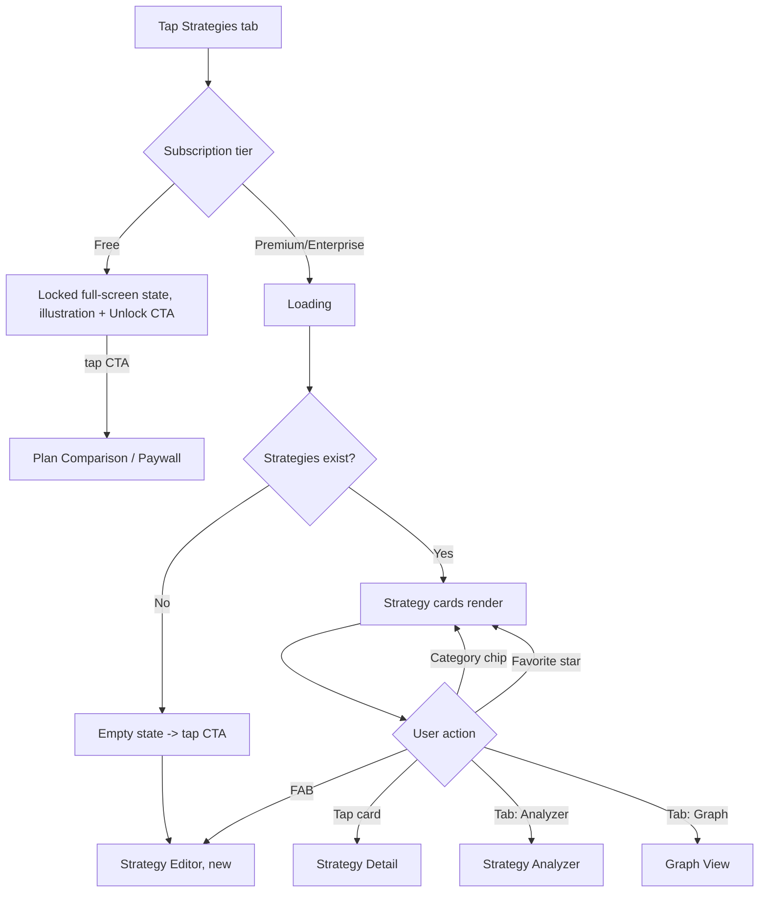
```mermaid
flowchart TD
    A[Tap Strategies tab] --> B{Subscription tier}
    B -- Free --> C[Locked full-screen state, illustration + Unlock CTA]
    C -->|tap CTA| D[Plan Comparison / Paywall]
    B -- Premium/Enterprise --> E[Loading]
    E --> F{Strategies exist?}
    F -- No --> G[Empty state -> tap CTA]
    F -- Yes --> H[Strategy cards render]
    G --> I[Strategy Editor, new]
    H --> J{User action}
    J -- Category chip --> H
    J -- Favorite star --> H
    J -- FAB --> I
    J -- Tap card --> K[Strategy Detail]
    J -- Tab: Analyzer --> L[Strategy Analyzer]
    J -- Tab: Graph --> M[Graph View]
```

### Strategy detail
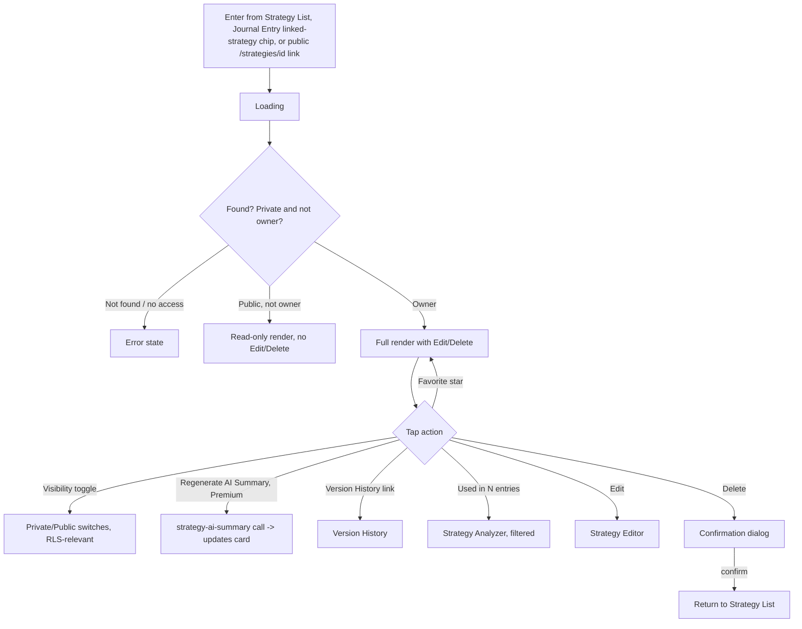
```mermaid
flowchart TD
    A[Enter from Strategy List, Journal Entry linked-strategy chip, or public /strategies/id link] --> B[Loading]
    B --> C{Found? Private and not owner?}
    C -- Not found / no access --> D[Error state]
    C -- Public, not owner --> E[Read-only render, no Edit/Delete]
    C -- Owner --> F[Full render with Edit/Delete]
    F --> G{Tap action}
    G -- Visibility toggle --> H[Private/Public switches, RLS-relevant]
    G -- Favorite star --> F
    G -- Regenerate AI Summary, Premium --> I[strategy-ai-summary call -> updates card]
    G -- Version History link --> J[Version History]
    G -- Used in N entries --> K[Strategy Analyzer, filtered]
    G -- Edit --> L[Strategy Editor]
    G -- Delete --> M[Confirmation dialog] -->|confirm| N[Return to Strategy List]
```

### Strategy editor
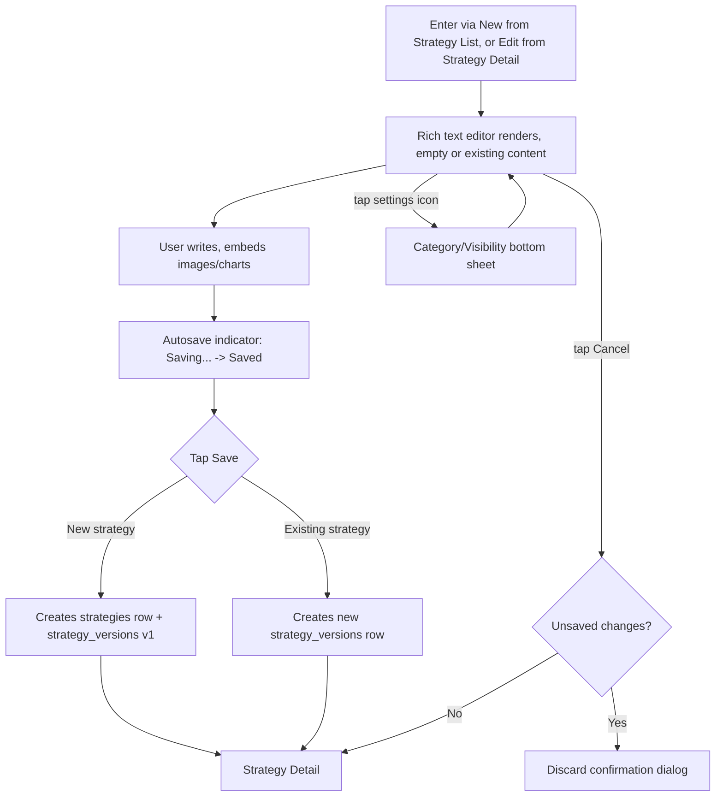
```mermaid
flowchart TD
    A[Enter via New from Strategy List, or Edit from Strategy Detail] --> B[Rich text editor renders, empty or existing content]
    B --> C[User writes, embeds images/charts]
    C --> D[Autosave indicator: Saving... -> Saved]
    D --> E{Tap Save}
    E -- New strategy --> F[Creates strategies row + strategy_versions v1]
    E -- Existing strategy --> G[Creates new strategy_versions row]
    F --> H[Strategy Detail]
    G --> H
    B -->|tap settings icon| I[Category/Visibility bottom sheet] --> B
    B -->|tap Cancel| J{Unsaved changes?}
    J -- Yes --> K[Discard confirmation dialog]
    J -- No --> H
```

### Version history
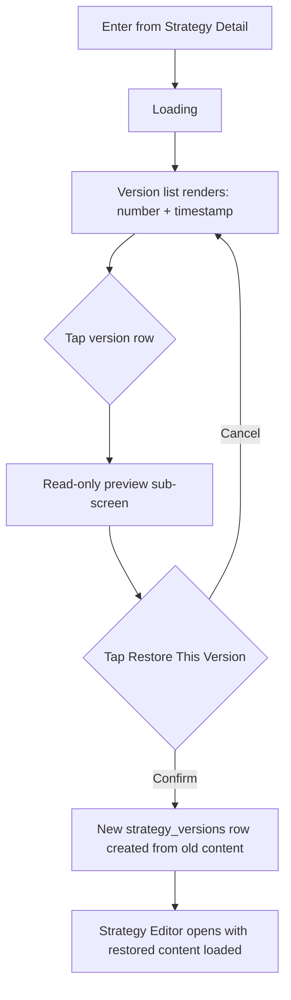
```mermaid
flowchart TD
    A[Enter from Strategy Detail] --> B[Loading]
    B --> C[Version list renders: number + timestamp]
    C --> D{Tap version row}
    D --> E[Read-only preview sub-screen]
    E --> F{Tap Restore This Version}
    F -- Confirm --> G[New strategy_versions row created from old content]
    G --> H[Strategy Editor opens with restored content loaded]
    F -- Cancel --> C
```

### Strategy analyzer
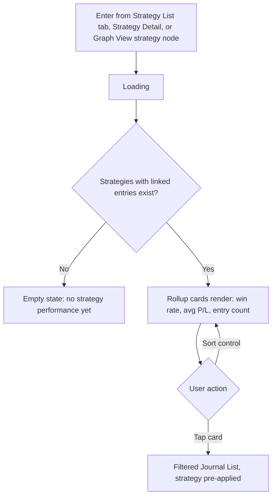
```mermaid
flowchart TD
    A[Enter from Strategy List tab, Strategy Detail, or Graph View strategy node] --> B[Loading]
    B --> C{Strategies with linked entries exist?}
    C -- No --> D[Empty state: no strategy performance yet]
    C -- Yes --> E[Rollup cards render: win rate, avg P/L, entry count]
    E --> F{User action}
    F -- Sort control --> E
    F -- Tap card --> G[Filtered Journal List, strategy pre-applied]
```

### Graph view
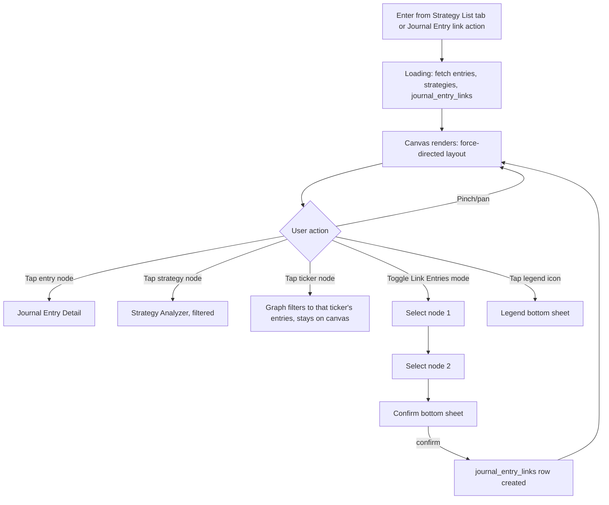
```mermaid
flowchart TD
    A[Enter from Strategy List tab or Journal Entry link action] --> B[Loading: fetch entries, strategies, journal_entry_links]
    B --> C[Canvas renders: force-directed layout]
    C --> D{User action}
    D -- Pinch/pan --> C
    D -- Tap entry node --> E[Journal Entry Detail]
    D -- Tap strategy node --> F[Strategy Analyzer, filtered]
    D -- Tap ticker node --> G[Graph filters to that ticker's entries, stays on canvas]
    D -- Toggle Link Entries mode --> H[Select node 1] --> I[Select node 2] --> J[Confirm bottom sheet] -->|confirm| K[journal_entry_links row created] --> C
    D -- Tap legend icon --> L[Legend bottom sheet]
```

---

## 4. Watchlists

### Watchlist list
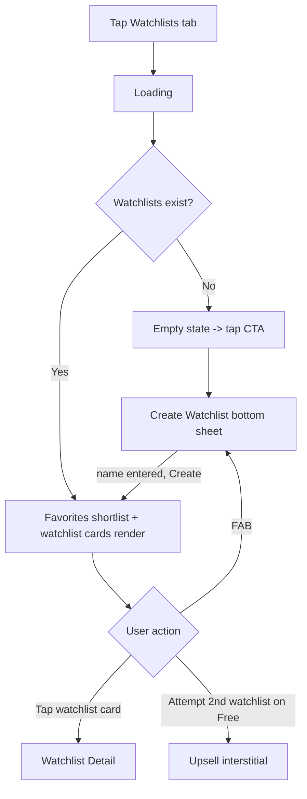
```mermaid
flowchart TD
    A[Tap Watchlists tab] --> B[Loading]
    B --> C{Watchlists exist?}
    C -- No --> D[Empty state -> tap CTA]
    C -- Yes --> E[Favorites shortlist + watchlist cards render]
    D --> F[Create Watchlist bottom sheet]
    E --> G{User action}
    G -- FAB --> F
    F -->|name entered, Create| E
    G -- Tap watchlist card --> H[Watchlist Detail]
    G -- Attempt 2nd watchlist on Free --> I[Upsell interstitial]
```

### Watchlist detail
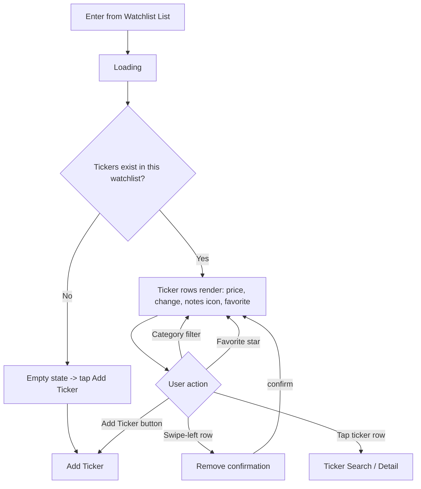
```mermaid
flowchart TD
    A[Enter from Watchlist List] --> B[Loading]
    B --> C{Tickers exist in this watchlist?}
    C -- No --> D[Empty state -> tap Add Ticker]
    C -- Yes --> E[Ticker rows render: price, change, notes icon, favorite]
    D --> F[Add Ticker]
    E --> G{User action}
    G -- Category filter --> E
    G -- Favorite star --> E
    G -- Swipe-left row --> H[Remove confirmation] -->|confirm| E
    G -- Add Ticker button --> F
    G -- Tap ticker row --> I[Ticker Search / Detail]
```

### Add ticker
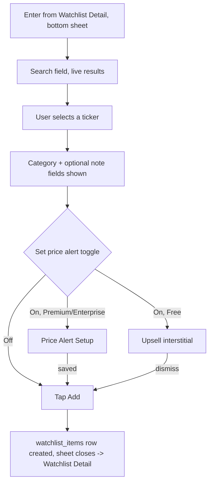
```mermaid
flowchart TD
    A[Enter from Watchlist Detail, bottom sheet] --> B[Search field, live results]
    B --> C[User selects a ticker]
    C --> D[Category + optional note fields shown]
    D --> E{Set price alert toggle}
    E -- On, Premium/Enterprise --> F[Price Alert Setup]
    E -- On, Free --> G[Upsell interstitial]
    E -- Off --> H[Tap Add]
    F -->|saved| H
    G -->|dismiss| H
    H --> I[watchlist_items row created, sheet closes -> Watchlist Detail]
```

### Price alert setup
```mermaid
flowchart TD
    A[Enter from Add Ticker or existing ticker row] --> B[Above/Below toggle, threshold input]
    B --> C[Live preview text updates]
    C --> D{Tap Save Alert}
    D -- Invalid threshold --> B
    D -- Valid --> E[watchlist_items.price_alert_threshold set]
    E --> F[Sheet closes -> Watchlist Detail]
```

---

## 5. Portfolio dashboard

### Portfolio dashboard
```mermaid
flowchart TD
    A[Tap Portfolio tab] --> B[Loading: fetch portfolio_stats view + entries]
    B --> C{Any journal entries with pnl?}
    C -- No --> D[Empty state: no performance data yet -> tap CTA]
    D --> E[Journal Entry Create]
    C -- Yes --> F[Headline stat cards + charts render]
    F --> G{User action}
    G -- Time-range toggle --> F
    G -- Best/Worst Trade card --> H[Journal Entry Detail]
    G -- Strategy Performance, Premium --> I[Strategy Performance Breakdown]
    G -- Strategy Performance, Free --> J[Upsell banner, no navigation]
```

### Strategy performance breakdown
```mermaid
flowchart TD
    A[Enter from Portfolio Dashboard] --> B[Loading]
    B --> C[Rollup cards render, reused Strategy Analyzer component]
    C --> D{User action}
    D -- Sort control --> C
    D -- Tap card --> E[Strategy Analyzer, filtered]
```

---

## 6. Community

### Community feed
```mermaid
flowchart TD
    A[Tap Community tab] --> B[Loading]
    B --> C{Posts exist for this filter?}
    C -- No --> D[Empty state]
    C -- Yes --> E[Post cards render]
    E --> F{User action}
    F -- Content-type filter chip --> B
    F -- Pull-to-refresh --> B
    F -- FAB --> G[Create Post]
    F -- Tap post card --> H[Post Detail]
    F -- Tap saved-posts icon --> I[Saved Posts]
    F -- Tap author avatar --> J[Public Profile]
    F -- Free tier at daily limit --> K[Read-limit banner shown, further reads blocked until reset]
```

### Post detail
```mermaid
flowchart TD
    A[Enter from Community Feed, Saved Posts, or public /community/postId link] --> B[Loading]
    B --> C{Found?}
    C -- No --> D[Error state]
    C -- Yes --> E[Full post + comment thread render]
    E --> F{Tap action}
    F -- Like --> E
    F -- Save --> E
    F -- Comment input, submit --> E
    F -- Tap author --> G[Public Profile]
    F -- Overflow: Report/Block/Mute --> H[Confirmation / report form sub-screen]
    F -- Logged-out user attempts like/comment --> I[Inline login prompt] --> J[Log In] -->|success| E
```

### Create post
```mermaid
flowchart TD
    A[Enter from Community Feed FAB] --> B[Form: content-type picker, text area]
    B --> C{Add image?}
    C -- Yes --> D[Camera/gallery bottom sheet] --> E[Thumbnail preview]
    C -- No --> F
    E --> F[Fill ticker tag, optional]
    F --> G{Tap Post}
    G -- Missing content type or text --> B
    G -- Valid --> H[posts row created -> Community Feed, new post at top]
    B -->|tap Cancel| I{Unsaved content?}
    I -- Yes --> J[Discard confirmation dialog]
    I -- No --> K[Return to Community Feed]
```

### Saved posts
```mermaid
flowchart TD
    A[Enter from Community Feed icon] --> B[Loading]
    B --> C{Saved posts exist?}
    C -- No --> D[Empty state]
    C -- Yes --> E[Post cards render]
    E --> F{User action}
    F -- Swipe-to-unsave --> E
    F -- Tap card --> G[Post Detail]
```

### Followers and following list
```mermaid
flowchart TD
    A[Enter from own or public Profile stat row] --> B[Loading]
    B --> C[User rows render]
    C --> D{User action}
    D -- Segmented toggle Followers/Following --> B
    D -- Search field --> C
    D -- Tap row --> E[Public Profile]
    D -- Tap follow/unfollow button --> C
```

---

## 7. Direct messages

### Direct messages list
```mermaid
flowchart TD
    A[Tap Messages icon on Community Feed] --> B{Subscription tier}
    B -- Free --> C[Locked full-screen state, illustration + Unlock CTA]
    C -->|tap CTA| D[Plan Comparison / Paywall]
    B -- Premium/Enterprise --> E[Loading]
    E --> F{Conversations exist?}
    F -- No --> G[Empty state -> tap CTA]
    F -- Yes --> H[Conversation rows render, sorted by last_message_at]
    G --> I[New Message]
    H --> J{User action}
    J -- New-message icon --> I
    J -- Tap conversation row --> K[Conversation Detail]
    J -- Swipe-left --> L[Mute / Delete, local hide only]
```

### Conversation detail
```mermaid
flowchart TD
    A[Enter from Direct Messages List, New Message, or a Public Profile Message button] --> B[Loading: message history + Realtime subscription]
    B --> C{Any messages yet?}
    C -- No --> D[Say hello empty-state prompt]
    C -- Yes --> E[Message bubbles render, newest at bottom]
    D --> F
    E --> F{Can the current user send?}
    F -- Yes, Premium/Enterprise, not blocked --> G[Input bar active]
    F -- Subscription lapsed mid-thread --> H[Input bar replaced: resubscribe strip, history stays visible]
    F -- Either party has blocked the other --> I[Input bar replaced: neutral blocked message]
    G --> J[Type + send] --> K[messages row inserted -> Realtime pushes to both devices] --> E
    E -->|new message arrives via Realtime| E
    A -->|tap counterpart avatar| L[Public Profile]
    A -->|overflow: Mute| M[Conversation muted, stays in list]
    A -->|overflow: Block| N[blocks row created -> both directions blocked immediately]
    A -->|overflow: Report| O[Report form sub-screen]
```

### New message
```mermaid
flowchart TD
    A[Enter from Direct Messages List or a Public Profile Message button, Premium/Enterprise only] --> B[Handle search field]
    B --> C[Results render: avatar, handle, follow-relationship indicator]
    C --> D{Tap a result}
    D --> E{Conversation with this person already exists?}
    E -- Yes --> F[Open existing Conversation Detail]
    E -- No --> G[Open new Conversation Detail, empty-thread state]
```

---

## 8. AI trading assistant

### Ticker search and detail
```mermaid
flowchart TD
    A[Enter from Insights tab, Watchlist row, or Daily Digest mover] --> B[Loading: price + indicators]
    B --> C[Chart + indicator toggles render]
    C --> D{Subscription tier}
    D -- Free --> E[News/Sentiment + Ask AI show locked state]
    D -- Premium/Enterprise --> F[News/Sentiment card renders, Ask AI button active]
    F -->|tap Ask AI| G[AI Trading Assistant chat, scoped to ticker]
    E -->|tap locked feature| H[Upsell interstitial]
```

### AI trading assistant chat
```mermaid
flowchart TD
    A[Enter from Ticker Detail, Watchlist Detail, or Insights tab] --> B[Scope selector: ticker/watchlist/portfolio]
    B --> C[Chat thread renders, prior messages if any]
    C --> D{User action}
    D -- Quick-action chip --> E[Pre-filled prompt sent] --> F[ai-insight call] --> G[AI message rendered with disclaimer]
    D -- Type message --> F
    G --> C
```

### Trade review results
```mermaid
flowchart TD
    A[Enter from Journal Entry Detail, AI Trade Review button] --> B[Loading: ai-journal-analysis, single-entry mode]
    B --> C[AI commentary renders with disclaimer]
    C --> D{User action}
    D -- Re-run --> B
    D -- Dismiss --> E[Return to Journal Entry Detail]
```

### AI strategy review results
```mermaid
flowchart TD
    A[Enter from Strategy Detail, AI Strategy Review action] --> B[Loading: ai-strategy-review call]
    B --> C[Review + flagged rules render]
    C --> D{User action}
    D -- Re-run --> B
    D -- Dismiss --> E[Return to Strategy Detail]
```

### AI journal analysis results
```mermaid
flowchart TD
    A[Enter from Journal List, AI Journal Analysis action] --> B[Date range + strategy filter picker]
    B --> C{Submit}
    C --> D[Loading: ai-journal-analysis call]
    D --> E[Pattern summary renders with disclaimer]
    E -->|adjust filters| B
```

### Weekly and monthly performance review
```mermaid
flowchart TD
    A[Enter from Insights tab or AI recommendation notification] --> B[Period selector: weekly/monthly]
    B --> C[Loading: reads portfolio_stats + ai-journal-analysis period mode]
    C --> D[Narrative summary + key stat chips render]
    D -->|switch period| B
```

### Daily digest
```mermaid
flowchart TD
    A[Enter from Insights tab or push notification tap] --> B[Loading]
    B --> C[Top movers list + AI summary render]
    C --> D{Tap a mover}
    D --> E[Ticker Search / Detail]
```

---

## 9. Notifications

### Notification center
```mermaid
flowchart TD
    A[Enter from bell icon, any screen] --> B[Loading]
    B --> C{Notifications exist?}
    C -- No --> D[Empty state]
    C -- Yes --> E[Grouped list renders by category]
    E --> F{User action}
    F -- Tap notification --> G[notifications.read_at set] --> H[Deep link navigates to relevant screen, per DYNAMIC_LINKING.md]
    F -- Mark all read --> E
    F -- Preferences icon --> I[Notification Preferences]
```

### Notification preferences
```mermaid
flowchart TD
    A[Enter from Settings or Notification Center] --> B[Category toggle list renders]
    B --> C{Toggle a category}
    C --> D[Push / in-app-only choice updates inline, no navigation]
```

---

## 10. Subscriptions

### Plan comparison and paywall
```mermaid
flowchart TD
    A[Enter from any upsell interstitial, Profile tier badge, or Settings] --> B[Three-column plan comparison renders]
    B --> C{Billing cycle toggle}
    C --> D[Premium price updates]
    D --> E{Tap action}
    E -- Upgrade, Premium column --> F[Upgrade / Checkout]
    E -- Contact Us, Enterprise column --> G[Contact form / email link, external]
    E -- Close --> H[Return to originating screen]
```

### Upgrade and checkout
```mermaid
flowchart TD
    A[Enter from Plan Comparison] --> B[Plan/cycle/price recap]
    B --> C[Native purchase sheet or Stripe checkout]
    C --> D{Purchase result}
    D -- Success --> E[Success sub-screen: confirmation + Continue]
    D -- Failure --> F[Error sub-screen: Try Again / Contact Support]
    E --> G[Return to originating screen, feature unlocked]
    F -->|Try Again| C
```

### Manage subscription
```mermaid
flowchart TD
    A[Enter from Profile tier badge or Settings] --> B[Loading]
    B --> C[Current plan card renders]
    C --> D{User action}
    D -- Change Plan --> E[Plan Comparison]
    D -- Cancel Subscription --> F[Confirmation dialog] -->|confirm| G[Deep-link to store subscription management, iOS/Android] 
    D -- Billing history, web only --> H[History list renders inline]
```

---

## 11. Enterprise (post-MVP)

### Organization dashboard
```mermaid
flowchart TD
    A[Enter from Settings, Organization row, org-admin accounts only] --> B[Loading]
    B --> C[Quick-link cards render]
    C --> D{Tap card}
    D -- Team --> E[Team Management]
    D -- Admin Controls --> F[Admin Controls]
    D -- Analytics --> G[Organization Analytics]
    D -- Branding --> H[Branding Settings]
    D -- API Keys --> I[API Access / Key Management]
```

### Team management
```mermaid
flowchart TD
    A[Enter from Org Dashboard] --> B[Loading]
    B --> C[Member list renders]
    C --> D{User action}
    D -- FAB --> E[Invite Member bottom sheet] --> F{Submit}
    F -- Valid --> G[Invite sent, member added as pending] --> C
    D -- Swipe-left row --> H[Remove confirmation dialog] -->|confirm| C
    D -- Tap role chip --> I[Role assignment picker] --> C
```

### Admin controls
```mermaid
flowchart TD
    A[Enter from Org Dashboard] --> B[Loading]
    B --> C[Feature toggle list + moderation queue + device list render]
    C --> D{User action}
    D -- Toggle feature flag --> C
    D -- Tap moderation item --> E[Review sub-screen: approve/remove]
    D -- Tap device row --> F[Device detail sub-screen: revoke license]
```

### Organization analytics
```mermaid
flowchart TD
    A[Enter from Org Dashboard] --> B[Loading]
    B --> C[Date range control + aggregate stat cards render]
    C --> D{Change date range}
    D --> B
```

### Branding settings
```mermaid
flowchart TD
    A[Enter from Org Dashboard] --> B[Current logo/theme/domain render]
    B --> C{User action}
    C -- Logo upload --> D[Image picker] --> E[Preview updates]
    C -- Color theme --> F[Theme picker] --> E
    C -- Custom domain, web --> G[Field edit + validation]
    E --> H{Save}
    G --> H
    H -- Success --> B
```

### API access and key management
```mermaid
flowchart TD
    A[Enter from Org Dashboard] --> B[Loading]
    B --> C[Key list renders: name, scope, last used]
    C --> D{User action}
    D -- FAB Create Key --> E[Name + scope form] --> F{Submit}
    F -- Success --> G[Key created, one-time reveal sub-screen with copy button]
    G -->|tap Done| C
    D -- Swipe-left row --> H[Revoke confirmation dialog] -->|confirm| C
```

---

## 12. Subscription tier flow overlay
This overview tracks where access branches by subscription tier across the product lifecycle.

```mermaid
flowchart TD
    A[User reaches a gated action] --> B{Which tier gate?}
    B -- Strategy Notes editor/analyzer/graph --> C{Free?}
    B -- 2nd+ watchlist or price alerts --> D{Free?}
    B -- AI Trading Assistant / Strategy Review / Journal Analysis / Trade Review / Performance Review --> E{Free?}
    B -- Strategy Performance Breakdown --> F{Free?}
    B -- Unlimited community reads/interaction --> G{Free, at daily cap?}
    B -- Direct Messages: open list / start conversation --> N{Free?}
    B -- Org features --> H{Enterprise member?}
    C -- Yes --> I[Locked state / upsell interstitial -> Plan Comparison]
    D -- Yes --> I
    E -- Yes --> I
    F -- Yes --> I
    G -- Yes --> I
    N -- Yes --> I
    H -- No --> J[Org section hidden entirely, not just locked]
    C -- No --> K[Full access]
    D -- No --> K
    E -- No --> K
    F -- No --> K
    G -- No --> K
    N -- No --> O[Full access]
    H -- Yes --> L[Org Dashboard accessible]
    I -->|Upgrade, success| K
    I -->|Not now| M[Return to originating screen, still locked]
    O -->|send each message| P{Still Premium/Enterprise at send time?}
    P -- No, downgraded mid-thread --> Q[Input bar replaced with resubscribe strip, not a full lockout]
    P -- Yes --> O
```

Direct messaging re-evaluates subscription status on every individual send attempt rather than relying solely on screen-mount validation, enforcing the per-message check specified in PRD requirements. All other features evaluate tier permissions once upon initial access.
